# Diagramas de secuencia

Diagramas basados en los casos de uso del documento "Copia de Proyecto Amelia Artefactosb.pdf".

> Nota: CU02 Recuperar contrasena se omite porque sera ajustado despues.

## CU01 - Iniciar Sesion

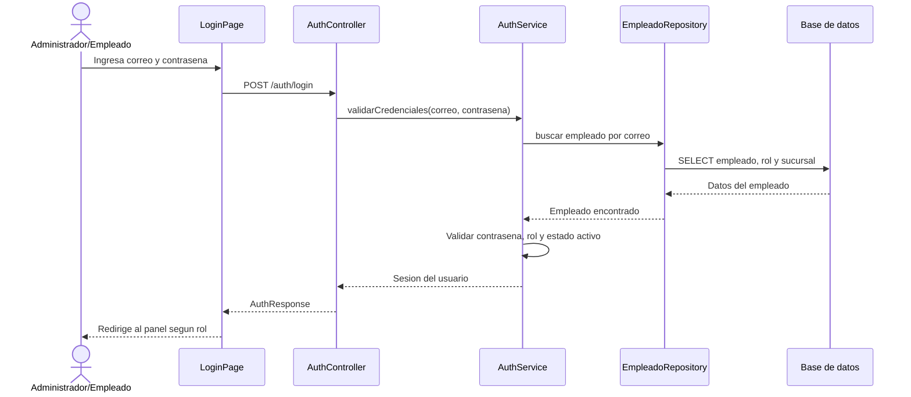

## CU03 - Configurar perfil de la empresa

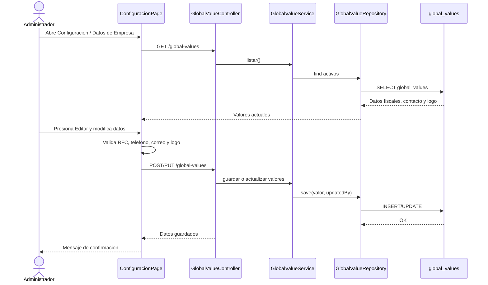

## CU04 - Registrar sucursal

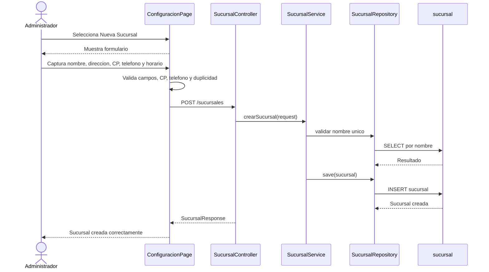

## CU05 - Actualizar sucursal

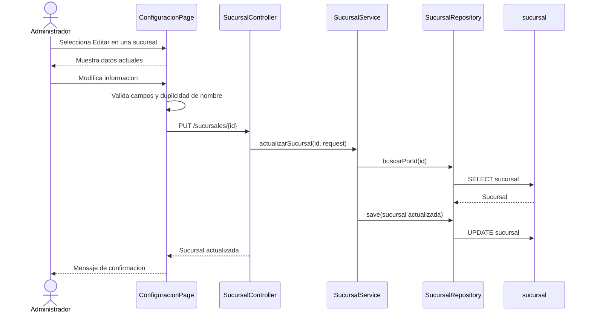

## CU06 - Registrar empleado

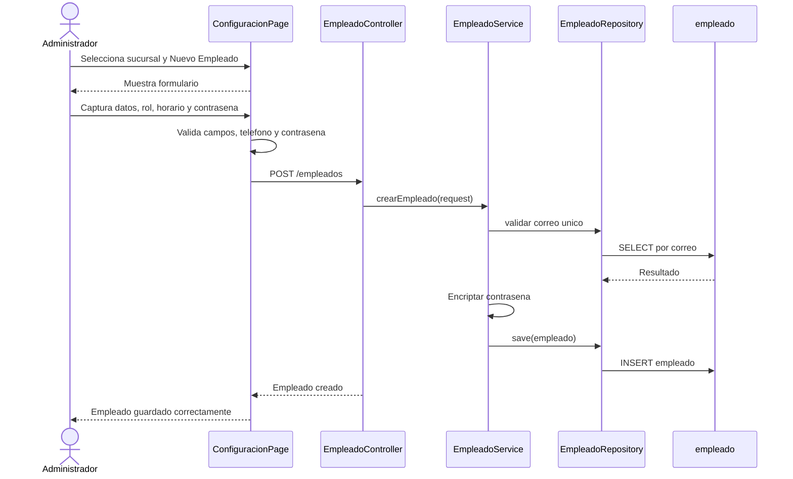

## CU07 - Actualizar datos de empleado

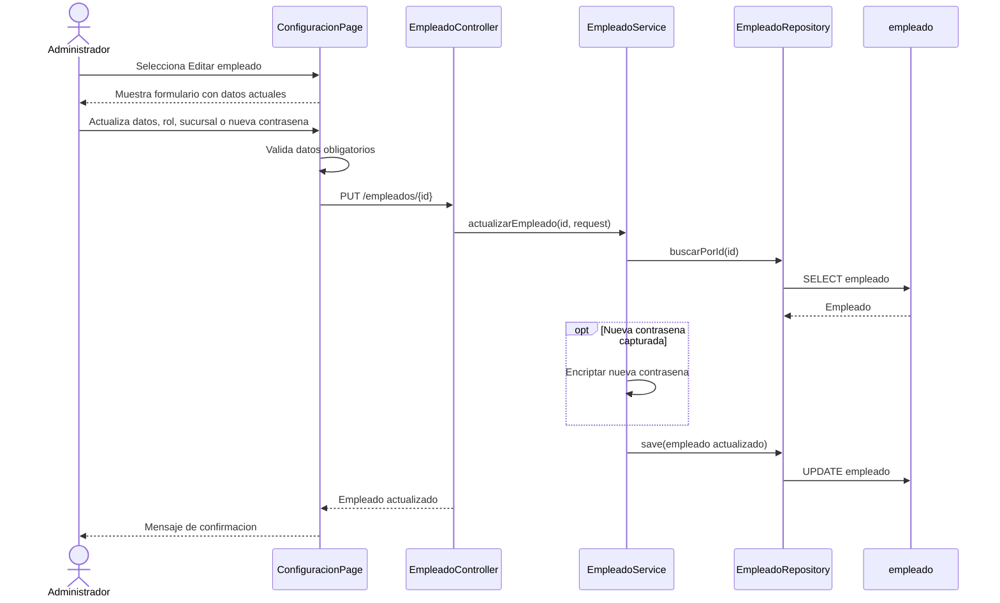

## CU08 - Eliminar empleado

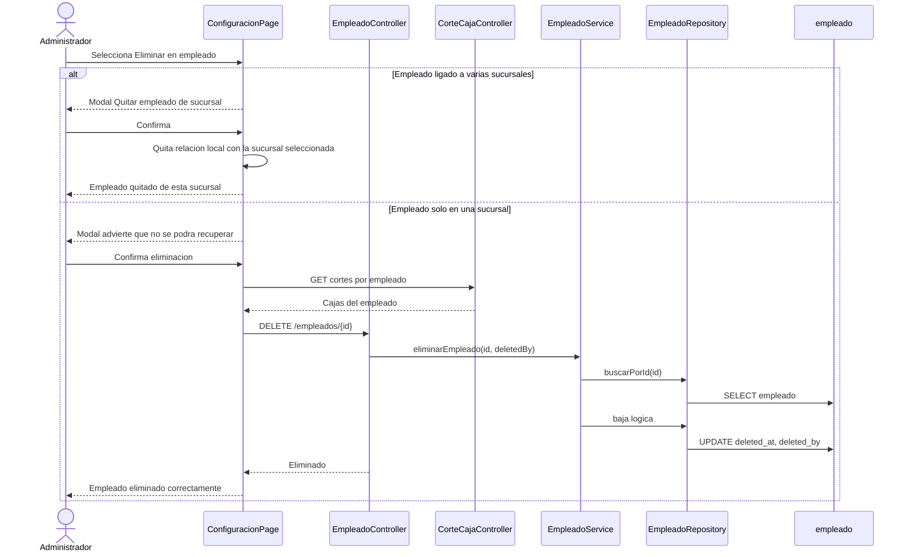

## CU09 - Registrar cliente

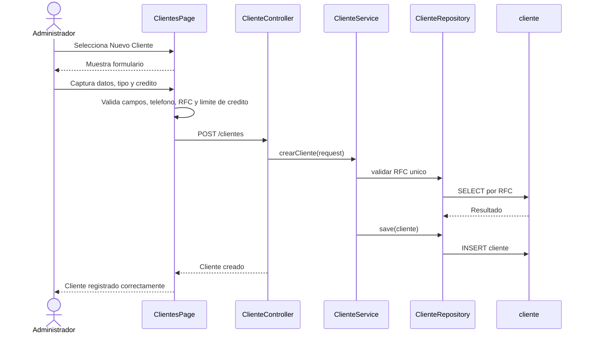

## CU10 - Actualizar datos del cliente

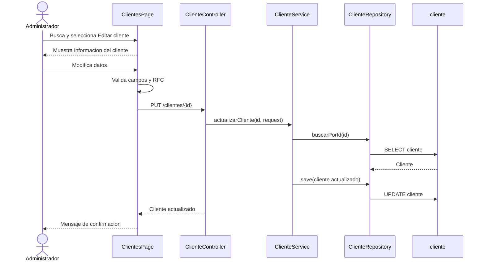

## CU11 - Consultar catalogo de clientes

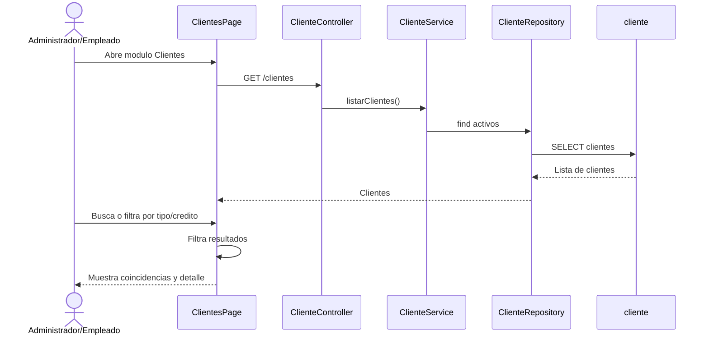

## CU12 - Alta de materiales

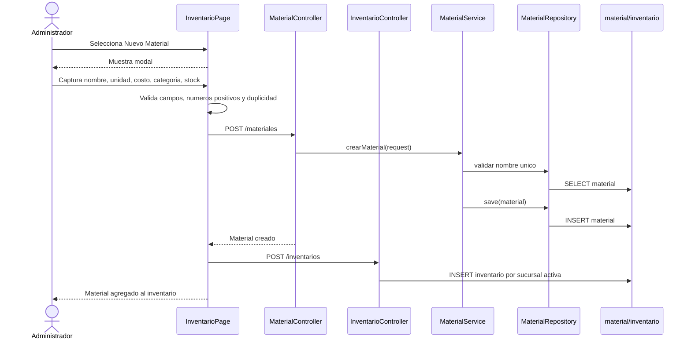

## CU13 - Baja de materiales

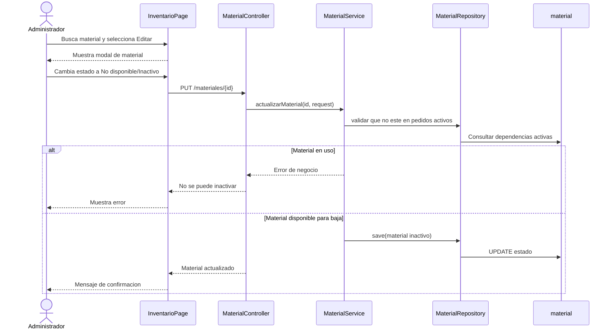

## CU14 - Consultar inventario

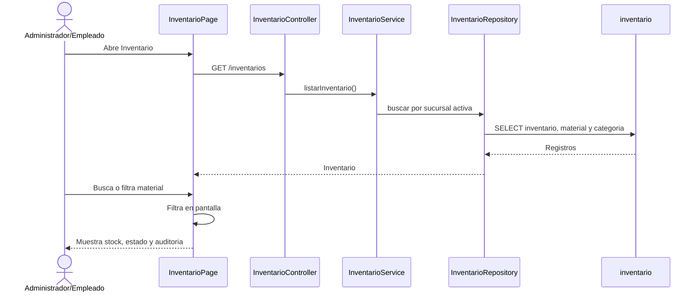

## CU15 - Registrar movimientos

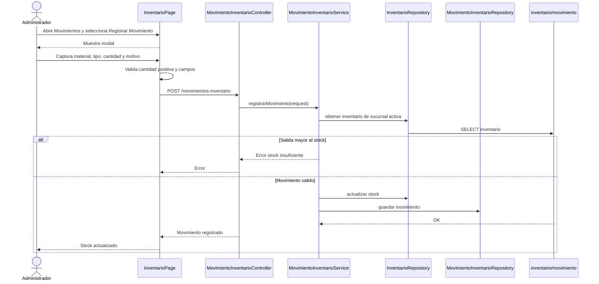

## CU16 - Crear servicios

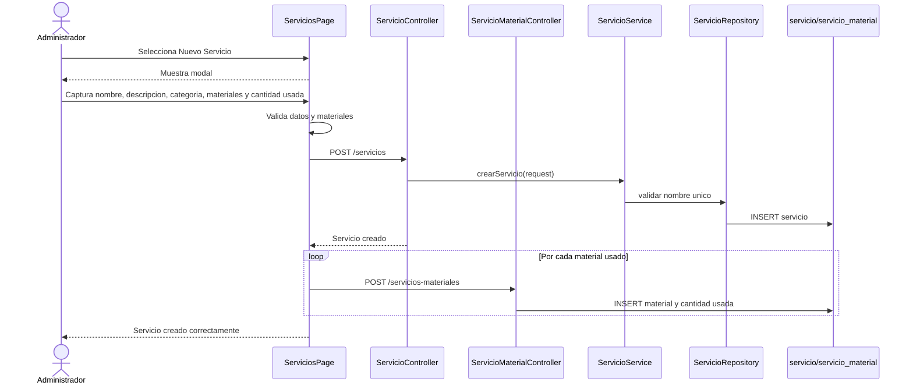

## CU17 - Agregar materiales al servicio

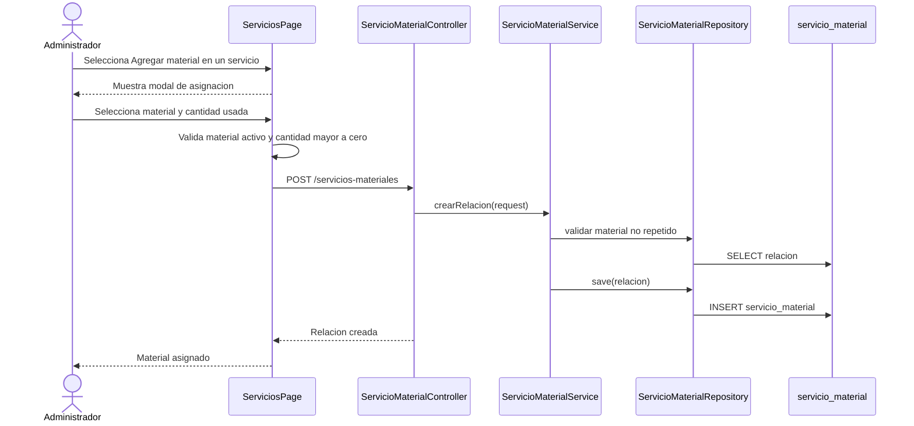

## CU18 - Editar servicios

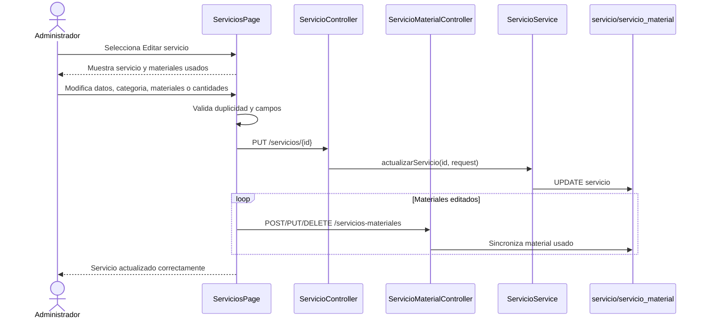

## CU19 - Activar y desactivar servicios

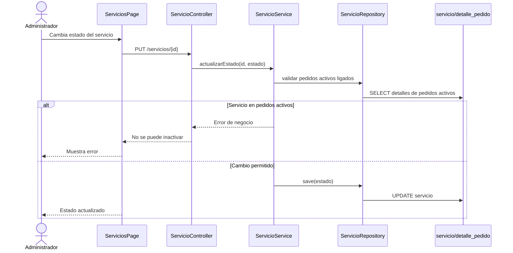

## CU20 - Abrir caja

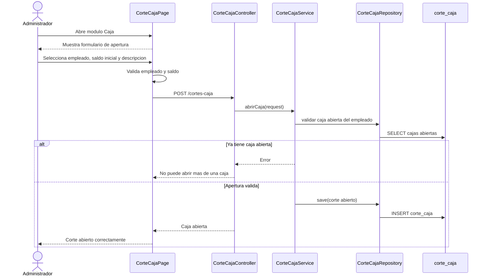

## CU21 - Generar corte de caja

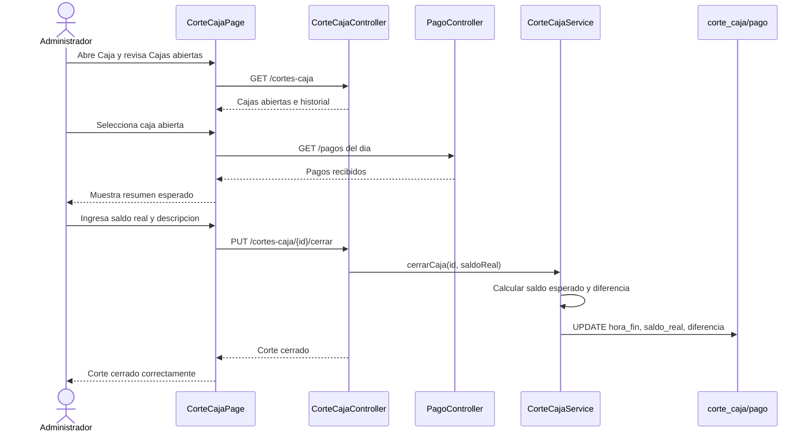

## CU22 - Generar reportes

```mermaid
sequenceDiagram
    actor Admin as Administrador
    participant UI as ReportesPage
    participant PedidoCtrl as PedidoController
    participant PagoCtrl as PagoController
    participant InvCtrl as InventarioController
    participant DB as Base de datos

    Admin->>UI: Abre Reportes
    Admin->>UI: Selecciona rango de fechas
    UI->>UI: Valida que desde no sea posterior a hasta
    UI->>PedidoCtrl: GET /pedidos
    PedidoCtrl->>DB: Consultar pedidos por sucursal activa
    UI->>PagoCtrl: GET /pagos
    PagoCtrl->>DB: Consultar pagos
    UI->>InvCtrl: GET /inventarios
    InvCtrl->>DB: Consultar inventario
    DB-->>UI: Datos para graficas y resumenes
    UI-->>Admin: Muestra reportes
```

## CU23 - Consultar pedido

```mermaid
sequenceDiagram
    actor Usuario as Administrador/Empleado
    participant UI as PedidosPage
    participant Ctrl as PedidoController
    participant DetCtrl as DetallePedidoController
    participant PagoCtrl as PagoController
    participant DB as pedido/detalle/pago

    Usuario->>UI: Abre Pedidos
    UI->>Ctrl: GET /pedidos
    Ctrl->>DB: SELECT pedidos por sucursal
    DB-->>UI: Lista de pedidos
    Usuario->>UI: Busca o filtra por estado/pago
    UI->>UI: Filtra pedidos
    Usuario->>UI: Expande pedido
    UI->>DetCtrl: GET /detalles-pedido
    UI->>PagoCtrl: GET /pagos
    DB-->>UI: Detalles y pagos realizados
    UI-->>Usuario: Muestra detalle, creador y pagos recibidos
```

## CU24 - Registrar pedido

```mermaid
sequenceDiagram
    actor Admin as Administrador
    participant UI as PuntoVentaPage
    participant PedCtrl as PedidoController
    participant DetCtrl as DetallePedidoController
    participant MovCtrl as MovimientoInventarioController
    participant DB as pedido/detalle/inventario

    Admin->>UI: Captura cliente, forma de pago, entrega y servicios
    UI->>UI: Valida cliente, servicios, precio y credito disponible
    UI->>PedCtrl: POST /pedidos
    PedCtrl->>DB: INSERT pedido con estado Pendiente
    PedCtrl-->>UI: Pedido creado
    loop Por cada servicio del resumen
        UI->>DetCtrl: POST /detalles-pedido
        DetCtrl->>DB: INSERT detalle
        UI->>MovCtrl: POST salida inventario
        MovCtrl->>DB: Descontar material usado una sola vez
    end
    UI-->>Admin: Pedido confirmado
```

## CU25 - Actualizar estado de pedido

```mermaid
sequenceDiagram
    actor Usuario as Administrador/Empleado
    participant UI as PedidosPage
    participant Ctrl as PedidoController
    participant Service as PedidoService
    participant DB as pedido

    Usuario->>UI: Cambia estado del pedido
    UI->>UI: Valida flujo permitido
    alt Cancelar pedido
        UI-->>Usuario: Solicita motivo de cancelacion
        Usuario->>UI: Ingresa motivo
    end
    UI->>Ctrl: PUT /pedidos/{id}
    Ctrl->>Service: actualizarEstado(id, estado, motivo)
    Service->>Service: Validar flujo Pendiente -> En proceso -> Terminado -> Entregado
    Service->>DB: UPDATE estado
    Ctrl-->>UI: Pedido actualizado
    UI-->>Usuario: Estado actualizado
```

## CU26 - Registrar pago

```mermaid
sequenceDiagram
    actor Usuario as Administrador/Empleado
    participant UI as PedidosPage
    participant PagoCtrl as PagoController
    participant PedidoCtrl as PedidoController
    participant Service as PagoService
    participant DB as pago/pedido/cliente

    Usuario->>UI: Selecciona Pago en un pedido
    UI-->>Usuario: Muestra modal de registro de pago
    Usuario->>UI: Captura monto, forma, concepto y referencia
    UI->>UI: Valida referencia obligatoria y monto pendiente
    UI->>PagoCtrl: POST /pagos
    PagoCtrl->>Service: registrarPago(request)
    Service->>DB: INSERT pago
    Service->>DB: Actualizar credito si aplica
    PagoCtrl-->>UI: Pago registrado
    UI->>PedidoCtrl: Refrescar pedido y pagos
    UI-->>Usuario: Muestra estado de pago actualizado
```

## CU27 - Aprobar/rechazar cotizacion

```mermaid
sequenceDiagram
    actor Admin as Administrador
    participant UI as PedidosPage
    participant Ctrl as PedidoController
    participant Service as PedidoService
    participant DB as pedido

    Admin->>UI: Selecciona cotizacion
    alt Aprobar
        Admin->>UI: Cambia de Borrador a Pendiente
        UI->>Ctrl: PUT /pedidos/{id}
        Ctrl->>Service: actualizar a Pendiente
        Service->>DB: UPDATE tipo/estado
        UI-->>Admin: Cotizacion convertida en pedido
    else Rechazar
        Admin->>UI: Selecciona Cancelar
        UI-->>Admin: Solicita motivo
        Admin->>UI: Captura motivo
        UI->>Ctrl: PUT /pedidos/{id}
        Ctrl->>Service: actualizar a Cancelado
        Service->>DB: UPDATE estado y motivo
        UI-->>Admin: Cotizacion cancelada
    end
```

## CU28 - Cerrar sesion

```mermaid
sequenceDiagram
    actor Usuario as Administrador/Empleado
    participant UI as AppLayout
    participant Auth as AuthContext
    participant Storage as LocalStorage

    Usuario->>UI: Selecciona Cerrar sesion
    UI->>Auth: logout()
    Auth->>Storage: Eliminar av_session
    Storage-->>Auth: Sesion eliminada
    Auth-->>UI: Usuario no autenticado
    UI-->>Usuario: Redirige a Login
```

## CU29 - Alta de categoria material

```mermaid
sequenceDiagram
    actor Admin as Administrador
    participant UI as InventarioPage
    participant Ctrl as CategoriaMaterialController
    participant Service as CategoriaMaterialService
    participant Repo as CategoriaMaterialRepository
    participant DB as categoria_material

    Admin->>UI: Abre tab Categorias y selecciona Nueva Categoria
    UI-->>Admin: Muestra modal
    Admin->>UI: Captura nombre, descripcion y estado
    UI->>UI: Valida campos y duplicidad
    UI->>Ctrl: POST /categorias-material
    Ctrl->>Service: crearCategoria(request)
    Service->>Repo: validar nombre unico
    Repo->>DB: SELECT categoria
    Service->>Repo: save(categoria)
    Repo->>DB: INSERT categoria_material
    UI-->>Admin: Categoria creada
```

## CU30 - Baja de categoria material

```mermaid
sequenceDiagram
    actor Admin as Administrador
    participant UI as InventarioPage
    participant Ctrl as CategoriaMaterialController
    participant Service as CategoriaMaterialService
    participant MatRepo as MaterialRepository
    participant DB as categoria_material/material

    Admin->>UI: Cambia categoria a Inactivo
    UI->>Ctrl: PUT /categorias-material/{id}
    Ctrl->>Service: actualizarCategoria(id, request)
    Service->>MatRepo: validar materiales ligados
    MatRepo->>DB: SELECT materiales por categoria
    alt Categoria ligada a materiales
        Service-->>Ctrl: Error de negocio
        Ctrl-->>UI: No se puede inactivar
        UI-->>Admin: Muestra mensaje
    else Sin materiales ligados
        Service->>DB: UPDATE estado Inactivo
        UI-->>Admin: Categoria actualizada
    end
```

## CU31 - Editar categoria material

```mermaid
sequenceDiagram
    actor Admin as Administrador
    participant UI as InventarioPage
    participant Ctrl as CategoriaMaterialController
    participant Service as CategoriaMaterialService
    participant Repo as CategoriaMaterialRepository
    participant DB as categoria_material

    Admin->>UI: Selecciona Editar categoria
    UI-->>Admin: Muestra modal con datos actuales
    Admin->>UI: Modifica nombre, descripcion o estado
    UI->>UI: Valida duplicidad
    UI->>Ctrl: PUT /categorias-material/{id}
    Ctrl->>Service: actualizarCategoria(id, request)
    Service->>Repo: save(categoria)
    Repo->>DB: UPDATE categoria_material
    Ctrl-->>UI: Categoria actualizada
    UI-->>Admin: Mensaje de confirmacion
```

## CU32 - Alta de categoria servicio

```mermaid
sequenceDiagram
    actor Admin as Administrador
    participant UI as ServiciosPage
    participant Ctrl as CategoriaServicioController
    participant Service as CategoriaServicioService
    participant Repo as CategoriaServicioRepository
    participant DB as categoria_servicio

    Admin->>UI: Abre tab Categorias y selecciona Nueva Categoria
    UI-->>Admin: Muestra modal
    Admin->>UI: Captura nombre, descripcion y estado
    UI->>UI: Valida campos y duplicidad
    UI->>Ctrl: POST /categorias-servicio
    Ctrl->>Service: crearCategoria(request)
    Service->>Repo: validar nombre unico
    Repo->>DB: SELECT categoria
    Service->>Repo: save(categoria)
    Repo->>DB: INSERT categoria_servicio
    UI-->>Admin: Categoria creada
```

## CU33 - Baja de categoria servicio

```mermaid
sequenceDiagram
    actor Admin as Administrador
    participant UI as ServiciosPage
    participant Ctrl as CategoriaServicioController
    participant Service as CategoriaServicioService
    participant ServRepo as ServicioRepository
    participant DB as categoria_servicio/servicio

    Admin->>UI: Cambia categoria a Inactivo
    UI->>Ctrl: PUT /categorias-servicio/{id}
    Ctrl->>Service: actualizarCategoria(id, request)
    Service->>ServRepo: validar servicios ligados
    ServRepo->>DB: SELECT servicios por categoria
    alt Categoria ligada a servicios
        Service-->>Ctrl: Error de negocio
        Ctrl-->>UI: No se puede inactivar
        UI-->>Admin: Muestra mensaje
    else Sin servicios ligados
        Service->>DB: UPDATE estado Inactivo
        UI-->>Admin: Categoria actualizada
    end
```

## CU34 - Editar categoria servicio

```mermaid
sequenceDiagram
    actor Admin as Administrador
    participant UI as ServiciosPage
    participant Ctrl as CategoriaServicioController
    participant Service as CategoriaServicioService
    participant Repo as CategoriaServicioRepository
    participant DB as categoria_servicio

    Admin->>UI: Selecciona Editar categoria
    UI-->>Admin: Muestra modal con datos actuales
    Admin->>UI: Modifica nombre, descripcion o estado
    UI->>UI: Valida duplicidad
    UI->>Ctrl: PUT /categorias-servicio/{id}
    Ctrl->>Service: actualizarCategoria(id, request)
    Service->>Repo: save(categoria)
    Repo->>DB: UPDATE categoria_servicio
    Ctrl-->>UI: Categoria actualizada
    UI-->>Admin: Mensaje de confirmacion
```
